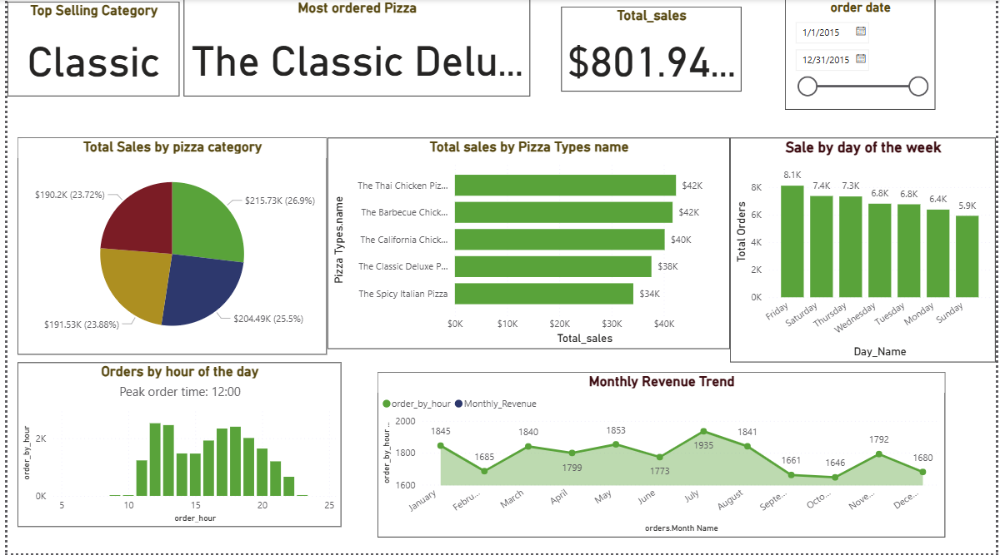

# Power BI Sales Analysis – Pizza Store

## Project Overview
This project focuses on analyzing pizza sales data using **Power BI** to identify revenue trends, customer ordering behavior, and top-performing products.  
The goal is to support **data-driven business decisions** related to sales performance, inventory planning, and customer demand.

---

## Dataset Description
- Dataset Type: Transactional sales data
- Time Period: January 2015 – December 2015
- Data Includes:
  - Order date and time
  - Pizza category and type
  - Quantity sold
  - Sales revenue
- File Format: CSV

---

## Tools and Technologies
- Power BI
- Power Query (ETL and Data Cleaning)
- DAX (Measures and Calculated Columns)
- GitHub (Project Version Control)

---

## Key Performance Indicators (KPIs)
- Total Revenue
- Total Orders
- Average Order Volume
- Top Selling Pizza
- Best Performing Pizza Category
- Peak Order Hour
- Monthly Revenue Trend

---

## Dashboard Analysis and Insights

### Sales by Pizza Category
- The **Classic** pizza category contributes the highest share of total revenue.
- Category-level analysis helps in product and pricing strategy.

### Top Selling Pizza Types
- The **Classic Deluxe Pizza** is the most ordered pizza.
- Identifies high-demand products for inventory optimization.

### Orders by Day of the Week
- Highest order volume occurs on **Friday and Saturday**.
- Indicates strong weekend demand.

### Orders by Hour of the Day
- Peak ordering time is around **12:00 PM**.
- Useful for workforce and operational planning.

### Monthly Revenue Trend
- Sales show noticeable variation across months.
- Helps in identifying seasonal patterns and forecasting demand.

---

## Dashboard Preview

---

## Project Structure
PowerBI-Sales-Analysis
│
├── data/
│ └── raw/ # Raw sales dataset
│
├── images/
│ └── dashboard_preview.png
│
├── Pizza_sales_dashboard.pbix # Power BI dashboard file
├── README.md

---

## Business Recommendations
- Increase staffing during peak lunch hours (12 PM – 2 PM).
- Focus promotions and offers during weekends.
- Prioritize inventory planning for top-selling pizza types.
- Use category-level insights to guide marketing campaigns.

---

## How to Run the Project
1. Download the `.pbix` file from the repository.
2. Open it using **Power BI Desktop**.
3. Use slicers and filters to explore sales insights.

---

## Skills Demonstrated
- Data Cleaning and Transformation
- Data Modeling
- DAX Calculations
- Interactive Dashboard Design
- Business Insight Generation
- Sales and Trend Analysis

